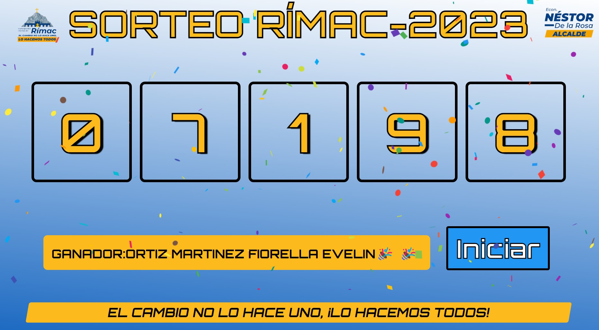

# SORTEO TRIBUTARIO- RÍMAC 2023
 Simulador de sorteo para la Municipalidad Distrital del Rímac.
# Tabla de contenido
- [Objetivo](#Objetivo)
- [Descripción del dominio de datos](#Descripción-del-dominio-de-datos)
- [Frontend](#Frontend)
  * [Screenshots de la GUI](#Screenshots-de-la-GUI)

## Descripcion del dominio de datos

Este conjunto de datos es un espejo de la data original de la data relacionada a los pagos tributarios del 2023 por cada contribuyente y a su vez está relacionada  a la cantidad de tickets que se le atribuye a cada contribuyente para el SORTEO DEL RÍMAC. Este conjunto de datos solo proporciona un archivo de xlsx. Este archivo contiene una entrada para cada papel, que contiene:

* **ticket_id**: Es el identificador único de cada ticket ligado a cada codigo de contribuyente.
* **codigo**: Es el código de contribuyente ligado a cada ticket ID dependiendo de las opciones.
* **nombre**: Es el nombre del contribuyente de la Municipalidad Distrital del Rímac.

### Screenshots de la GUI

### Ejecución de la GUI

